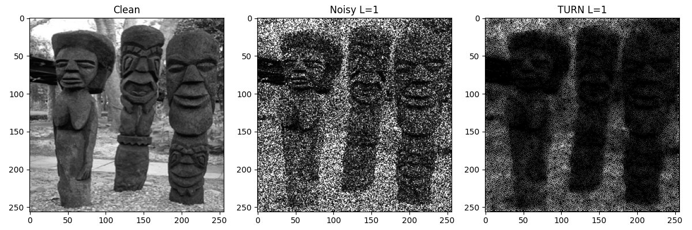
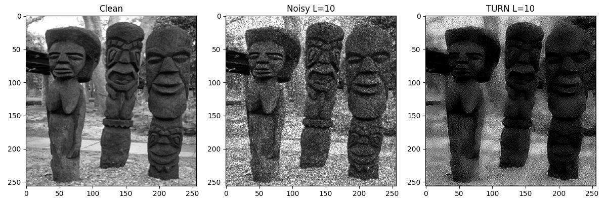

# TURN — Trainable Unrolled Regularization Network
### Speckle Image Denoising via Algorithm Unrolling

> **MMIP Project — Training & Evaluation**
> Keerthana · SE23UCAM017 · Multimedia Image Processing

---

## Overview

TURN is a deep learning model for removing **multiplicative Gamma speckle noise** from grayscale images. Instead of using a standard CNN, it unrolls a classical PDE-based denoising algorithm into **25 trainable stages** — each stage is one learnable iteration of the diffusion equation.

Two separate models are trained:
- **L = 1** — Heavy / SAR-like speckle noise
- **L = 10** — Moderate speckle noise

---

## How It Works

```
Noisy Image  →  log-transform  →  [Stage 1] → [Stage 2] → ... → [Stage 25]  →  exp  →  Denoised Image
```

Each stage has **4 learnable scalar parameters**:

| Parameter | Meaning |
|-----------|---------|
| `ν` (nu) | Saliency exponent — controls emphasis on bright regions |
| `k` | Edge sensitivity — suppresses diffusion across boundaries |
| `λ` (lambda) | Data fidelity weight — how closely output follows noisy input |
| `dt` | Step size — magnitude of each PDE update |

**Total trainable parameters: 25 × 4 = 100 per model**

---

## Results

Evaluated on the **BSD68 benchmark** (68 unseen test images):

| Model | PSNR (dB) | SSIM |
|-------|-----------|------|
| TURN L=1  (Heavy Speckle)   | 12.52 | 0.4264 |
| TURN L=10 (Moderate Speckle) | 19.11 | 0.8112 |

Train → Test PSNR drop: **~0.5 dB** — model generalizes well.

---

## Visual Results

**L = 1 — Heavy Speckle**


**L = 10 — Moderate Speckle**


---

## Project Structure

```
TURN-Speckle-Denoising/
│
├── train.py                  # Full training + evaluation script
├── requirements.txt          # Python dependencies
├── .gitignore
│
├── models/
│   ├── model_L1.pth          # Trained weights for L=1
│   └── model_L10.pth         # Trained weights for L=10
│
├── results/
│   ├── bsd68_L1_img0.png     # Visual output — L=1
│   ├── bsd68_L10_img0.png    # Visual output — L=10
│   ├── learned_parameters.xlsx  # All 25-stage learned parameters
│   └── test_results.xlsx        # Per-image PSNR & SSIM on BSD68
│
└── logs/
    └── MMIP_training.txt     # Training run log with loss curves
```

---

## How to Run

### 1. Install dependencies
```bash
pip install -r requirements.txt
```

### 2. Prepare dataset
Download [BSD400](https://www2.eecs.berkeley.edu/Research/Projects/CS/vision/bsds/) and place images in:
```
dataset/BSD400/
```

### 3. Train
```bash
python train.py --data dataset/BSD400 --epochs 80 --limit 80
```

### 4. Load a saved model and evaluate
```python
import torch
from train import TURN, load_dataset, evaluate

model = TURN()
model.load_state_dict(torch.load('models/model_L10.pth'))
dataset = load_dataset('dataset/BSD400')
evaluate(model, dataset, L=10)
```

---

## Training Setup

| Setting | Value |
|---------|-------|
| Training images | 80 (BSD400, 256×256 grayscale) |
| Epochs | 80 |
| Optimizer | Adam |
| Learning rate | 1 × 10⁻⁴ |
| Gradient clipping | Max norm = 1.0 |
| Loss function | MSE + 0.3·MAE + 0.2·Gradient Fidelity |

---

## Contribution

**Keerthana (SE23UCAM017)** was responsible for the dataset preparation and training pipeline of the TURN model. This included preprocessing 80 BSD400 images through resizing and normalization, applying multiplicative Gamma noise simulation for both L=1 and L=10 noise levels, executing the full PyTorch-based training pipeline in the log-domain over 80 epochs, and conducting quantitative evaluation on the BSD68 benchmark using PSNR and SSIM metrics.

---

## References

- Monga et al., *Algorithm Unrolling*, IEEE Signal Processing Magazine, 2021
- Martin et al., *BSD Dataset*, IEEE ICCV, 2001
- Perona & Malik, *Anisotropic Diffusion*, IEEE TPAMI, 1990
